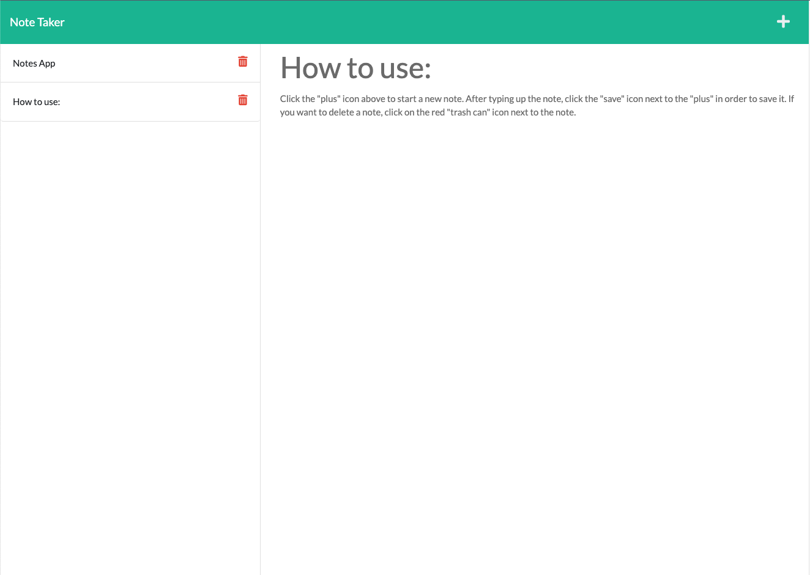

# 11-Note-Taker

## Description

This is the module 11 "Note Taker" by Jonathan Shogren. The challange was to create an application that can be used to write and save notes. It uses Express.js on the backend and saves and retrives data from a JSON file.

## User Story

```md
AS A small business owner
I WANT to be able to write and save notes
SO THAT I can organize my thoughts and keep track of tasks I need to complete
```

## Screenshot

Here is a screenshot of the finished site that was created with this tool:



## Additional Notes

* The site is live on Heroku: https://jon-shogren-note-taker.herokuapp.com/notes
